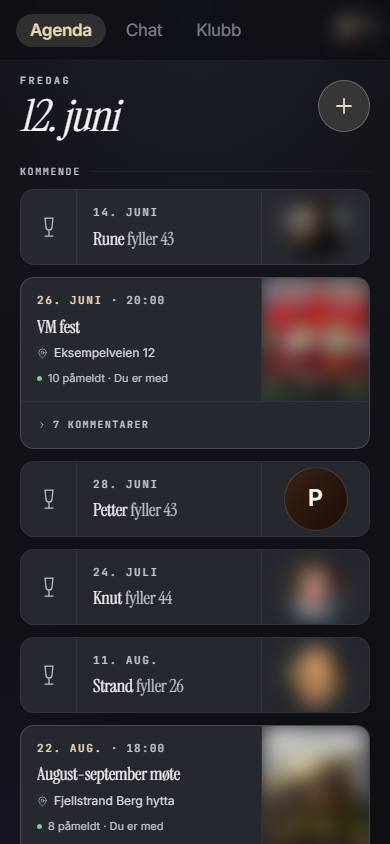
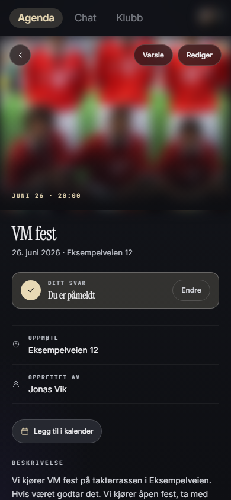
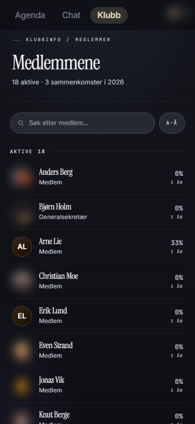
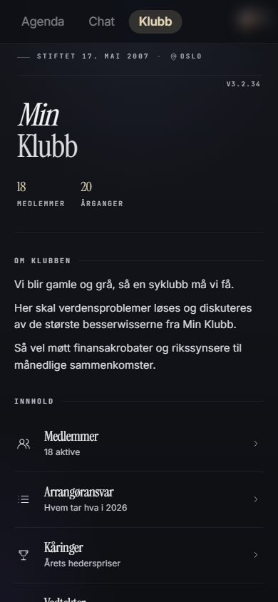
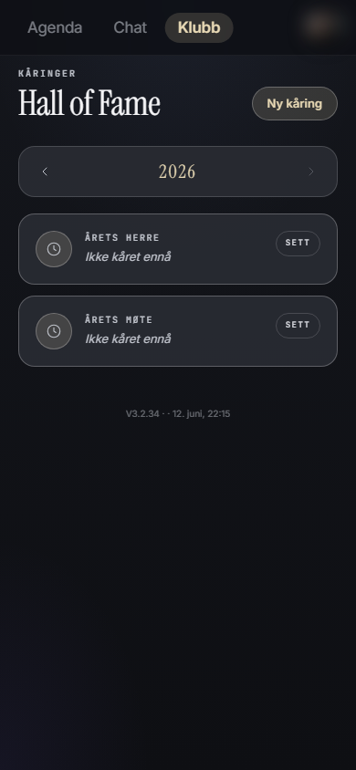
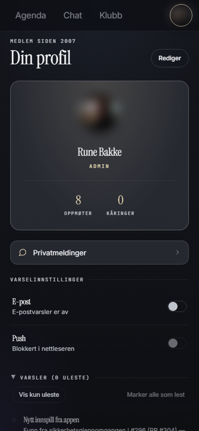

# Klubb-app

> **This project is intentionally in Norwegian** — UI text, code identifiers, table/column names, commit messages, and documentation are all in Norwegian. It was built for a Norwegian-speaking private club and is published as-is. You're welcome to fork it and translate it for your own club.

Privat web-app for vennegjenger som vil ha et felles sted for å holde kontakten med arrangementer og påmelding, chat, bilder, kåringer og statistikk — uten å være avhengig av Facebook, eller andre tjenester. Appen skal kunne driftes med gratis-tjenester.

---

## Innhold

- [Funksjonalitet](#funksjonalitet)
- [Skjermbilder](#skjermbilder)
- [Stack](#stack)
- [Kom i gang](#kom-i-gang)
- [Arkitektur](#arkitektur)
- [Datamodell](#datamodell)
- [Sentrale designvalg](#sentrale-designvalg)
- [Mappe-struktur](#mappe-struktur)
- [Testing](#testing)
- [Drift og deploy](#drift-og-deploy)
- [Miljøvariabler](#miljøvariabler)
- [Kritisk vurdering](#kritisk-vurdering)
- [Lisens](#lisens)

---

## Funksjonalitet

- **Agenda** — kronologisk feed av arrangementer, polls, meldinger (innlegg) og bursdager. Ser kommende, i dag, og tidligere ting i ett blikk. Mikro-månedskalender i headeren med arrangement- og bursdagsmarkering.
- **Arrangementer** — møter og turer. Påmelding (Ja/Nei/Kanskje), kommentarer, bilde, kobling til arrangøransvar, «Legg til i kalender» (ICS).
- **Polls** — flervalgs-avstemninger med svarfrist.
- **Meldinger** — Facebook-status-aktige innlegg med kommentarer og emoji-reaksjoner. Valgfri «aktuell dato» fester et innlegg øverst på agendaen til datoen er passert — med AI-forslag fra innleggsteksten (valgfritt, krever Anthropic-nøkkel).
- **Klubbchat** — én felles tråd for hele klubben. Egen Chat-tab i topp-headeren.
- **Privatmeldinger** — én-til-én-samtaler.
- **Album** — bildedelinger knyttet til arrangementer eller stå-alone. Cover-velger, lightbox med swipe og pil-navigering.
- **Roller og ansvar** — arrangøransvar per år, kåringer (årets vinnere innen ulike kategorier).
- **Klubbinfo** — vedtekter, medlemsliste, statistikk, historikk.
- **Bursdager og klubbjubileum** dukker opp automatisk på agendaen.
- **Push-varsler** og **e-post-påminnelser** for nye arrangementer, kommentarer, mentions og påminnelser om RSVP.
- **Mørk/lys modus** — brukervalgt tema (System/Mørk/Lys) fra profilsiden. «System» følger enhetens preferanse, valget huskes per enhet.
- **PWA** — installerbar på mobil (Safari/Chrome), service worker for offline-fallback.

---

## Skjermbilder

Fra en kjørende instans. Navn er fiktive og bilder blurret av personvernhensyn.

| Agenda | Arrangement | Medlemmer |
|---|---|---|
|  |  |  |

| Klubbinfo | Kåringer | Profil |
|---|---|---|
|  |  |  |

---

## Stack

| Lag | Teknologi |
|---|---|
| Frontend | Next.js 15 App Router, React 19, TypeScript, Tailwind v4 (mest inline-style) |
| Backend | Next.js Server Actions + Server Components |
| Database | Supabase Postgres med Row Level Security |
| Auth | Supabase Auth (email + passord) |
| Realtime | Supabase Realtime (postgres_changes) |
| Bildelagring | Cloudflare R2 (S3-kompatibel), `aws4fetch` for signing |
| E-post | Resend |
| Push | Web Push (VAPID) via `web-push` |
| AI (valgfritt) | Anthropic Claude Haiku for datoforslag — rå `fetch`, ingen SDK; av uten API-nøkkel |
| Cron | GitHub Actions (`paaminne.yml`, daglig 06:00 UTC) |
| Hosting | Vercel (Hobby) |
| Domene | Valgfritt — konfigureres via env-vars |
| Testing | Vitest (enhetstester) + Playwright (e2e mot lokal Supabase) |

~400 kildefiler (`.ts`, `.tsx`, `.sql`, `.css`, `.mjs`), ~110 nummererte SQL-migrasjoner.

---

## Kom i gang

For å sette opp din egen instans:

1. **[docs/oppsett.md](docs/oppsett.md)** — steg-for-steg fra klon til kjørende instans (Supabase, R2, VAPID, Resend, Vercel, GitHub Actions).
2. **[docs/klubb-tilpasning.md](docs/klubb-tilpasning.md)** — bytt navn, ikoner, farger og konfigurer rollene for din klubb.
3. **[docs/drift.md](docs/drift.md)** — legge til medlemmer, feilsøke varsler, kjøre migrasjoner og backup.

```bash
git clone <ditt-repo-url>
cd <ditt-repo>
npm install
cp .env.example .env.local
# fyll inn verdiene
npm run sjekk-miljo
npm run dev
```

---

## Arkitektur

```
┌────────────────────────────────────────────────────┐
│              Klient (PWA i nettleser)              │
│  React Server Components + Client Components       │
│  Service Worker (cache, offline, push)             │
└──┬──────────────────┬──────────────────────────────┘
   │ WSS (realtime)   │ HTTPS
   │                  ▼
   │    ┌────────────────────────────────────────┐
   │    │           Next.js på Vercel            │
   │    │  • Server Components (SSR)             │
   │    │  • Server Actions (mutasjoner)         │
   │    │  • Route handlers (cron, API)          │
   │    │  • Middleware (auth-guard via cookie)  │
   │    └──────┬──────────────┬────────────────┬─┘
   │           │              │                │
   │           │ supabase-js  │ aws4fetch      │ resend / web-push
   ▼           ▼              ▼                ▼
┌──────────────────┐    ┌───────────┐    ┌──────────────┐
│ Postgres         │    │ R2-bucket │    │ Resend / WP  │
│ + RLS + cron     │    │  (bilder) │    │ e-post / push│
│ + realtime       │    └───────────┘    └──────────────┘
└──────────────────┘
```

**Sikkerhetsmodellen** sentrerer rundt Postgres RLS. Server Actions kjører som innlogget bruker (Supabase auth-cookie sendes med). Det betyr at selv om en server action skulle ha en logikkfeil, kan ikke en bruker lese eller skrive data RLS-policyene ikke tillater. `er_admin()`-SQL-funksjonen brukes konsekvent i policies; klient-siden har egen `kanAdministrere(rolle)`-helper for UI-rendering.

En fullstendig gjennomgang av sikkerhetsmodellen er dokumentert i [docs/sikkerhetsgjennomgang-2026-06.md](docs/sikkerhetsgjennomgang-2026-06.md).

**Privat-bilder via R2.** Cloudflare R2 valgt foran Supabase Storage av to grunner: kostnad ($0 egress) og at bucket lever i EU-jurisdiksjon. URL-er er public (krever ingen signering), men sti inneholder UUID-prefix som gjør dem upraktiske å gjette.

---

## Datamodell

Hovedtabeller (forenklet):

```
profiles ─┬─ rolle (medlem|admin|generalsekretaer)
          ├─ aktiv (false = utmeldt, beholder historikk)
          └─ visningsnavn, bilde_url, fodselsdato

arrangementer ─┬─ type (moete|tur)
               ├─ start_tidspunkt, oppmoetested, bilde_url
               └─ paameldinger (status: ja|nei|kanskje)

poll ──── poll_valg ──── poll_stemme

meldinger (innlegg/posts)
  ├─ melding_chat (kommentarer)
  └─ melding_reaksjon

album ──── album_bilde (cover_bilde_id peker tilbake)

samtale (privat 1:1) ──── samtale_chat

5 chat-tabeller: arrangement_chat, klubb_chat, poll_chat,
                  melding_chat, samtale_chat
                  + delt chat_reaksjoner-tabell

arrangoransvar (hvem er ansvarlig for hvilke faste arrangementer per år)
kaaringmaler / kaaring_vinnere (kategorier og årets vinnere)
varsel_logg (alle utsendte push/epost loggføres)
feil_logg (klient-side JavaScript-feil med 30-dagers retention)
```

Alle tabeller har RLS slått på. Policy-mønsteret er typisk:

- `select`: aktiv profil i `profiles`
- `insert`: `auth.uid() = profil_id` + aktiv
- `update`/`delete`: eier eller `er_admin()`

Migrasjonene ligger i `supabase/migrations/` nummerert sekvensielt. Kjøres med `npx supabase db push`.

---

## Sentrale designvalg

Alle disse er kodifisert som «policies» i [`CLAUDE.md`](./CLAUDE.md) — referansen for AI-assistert utvikling fremover.

### Sentralisering der det betaler seg

- **Tid:** all dato-håndtering går gjennom `lib/dato.ts` med Europe/Oslo-tidssone via `date-fns-tz`. Ingen rå `new Date()` for å bestemme «hvilken dag det er».
- **Varsler:** all utgående kommunikasjon (push + epost) går gjennom `sendVarsel()` i `lib/varsler.ts` — sentral dedup, brukerpreferanser og logging.
- **Auth:** server actions bruker `ensureAdmin()` / `ensureInnlogget()` fra `lib/auth.ts`. Ingen inline `getUser() + select rolle`-mønster.
- **Roller:** `lib/roller.ts` har sentral matrise. Aldri `rolle === 'admin'`-sammenligning i kode — bruk `kanAdministrere()`. Speilet i SQL via `er_admin()`-funksjonen.
- **Konstanter:** tegnegrenser og dag-vinduer i `lib/konstanter.ts`. Ingen hardkodede magiske tall.
- **Konfig:** miljø-avhengige verdier (BASE_URL, R2_PUBLIC_URL, GitHub-repo, VAPID-kontakt) i `lib/config.ts`.
- **Klubbidentitet:** navn, stiftelsesdato, rolletitler i `lib/klubb-config.ts` med env-override — se [docs/klubb-tilpasning.md](docs/klubb-tilpasning.md).
- **Tema:** alle farger er tokens i `app/globals.css` per `data-theme` (dark/light). Brukervalget (System/Mørk/Lys) lagres i localStorage + cookie; serveren rendrer riktig tema i SSR og et pre-hydration-script hindrer feil-tema-blink ved oppstart.
- **Bildelagring:** server actions i `lib/actions/bilde-opplasting.ts` + `lib/r2.ts`. Klient komprimerer (1600px / q0.85) før upload.
- **Avatar:** `<Avatar>`-komponenten er bevisst enkel (kun `name`, `size`, `src`, `rolle`). Spesialtilfeller løses med lokale wrappere, ikke ved å utvide kjerne-komponenten.
- **Observability:** Sentry integreres kun server-side (bevisst holdt unna klienten av hensyn til bundle-størrelse). Klient-side JavaScript-feil fanges opp via global error boundary og logges til `feil_logg`-tabell med automatisk 30-dagers opprydding. Daglig cron varsler admins hvis mer enn 5 feil er logget siste døgn.

### Chat-arkitektur

Fem chat-scopes (arrangement, klubb, poll, melding, privat) deler tabell-mønster men er fysisk separate tabeller (RLS er enklere per-tabell enn polymorf med `scope_type`-kolonne). All scope-spesifikk logikk samles i `lib/chat-konfig.ts` (CHAT_KONFIG) og tre generiske server actions i `lib/actions/chat.ts` (`sendChatMelding`, `oppdaterChatMelding`, `slettChatMelding`).

### Hva som er bevisst utelatt

- **2FA / passkeys** — passordbasert er valgt nivå.
- **End-to-end-kryptering** av privatmeldinger.
- **Klient-side cache-lag** (TanStack Query) — SSR holder så langt.
- **Egen mobilapp** — PWA er valgt distribusjon.

---

## Mappe-struktur

```
app/
  (auth)/login/                    # Offentlig login-side
  (app)/                           # Auth-beskyttede sider med sticky TopHeader
    page.tsx                       # Forsiden = agenda
    arrangementer/[id]/            # Arrangement-detalj + edit
    poll/[id]/, /ny/
    meldinger/[id]/, /ny/
    chat/                          # Klubbchat (egen Chat-tab i topp-headeren)
    samtaler/, samtaler/[id]/      # Privat-meldinger
    album/, album/[id]/            # Bildealbum
    klubbinfo/                     # Vedtekter, medlemmer, statistikk
    arrangoransvar/                # Hvem ansvarer for hva (årsvis)
    kaaringer/                     # Vinnere per kategori og år
    profil/, profil/rediger/
    innstillinger/                 # Admin: medlemmer, varsler, pass-godkjenning
    varsler/[id]/                  # Stand-alone varsel-side (lenker fra epost)
    innspill/                      # GitHub Issues-bro: medlemmer kan ønske ting
  api/
    cron/paaminne/                 # GitHub Actions ringer hit kl 06:00 UTC

components/
  agenda/, arrangement/, album/, chat/, poll/   # Per-domene-komponenter
  ui/                                            # Avatar, Card, Pill, Icon, Lightbox
  TopHeader.tsx                                  # Sticky topp-header: tabs Agenda/Chat/Klubb + profil-avatar

lib/
  actions/         # Server actions — én fil per domene
  supabase/        # Browser- og server-clients, genererte typer
  chat-konfig.ts   # CHAT_KONFIG (se "Chat-arkitektur")
  auth.ts          # ensureInnlogget, ensureAdmin
  roller.ts        # Rolle-matrise + helpers
  varsler.ts       # sendVarsel + push/epost-helpere
  dato.ts          # Tidssone-trygge helpere
  konstanter.ts    # Domene-konstanter
  config.ts        # Miljø-avhengige verdier
  klubb-config.ts  # Klubbidentitet (navn, stiftelsesdato, rollekonfig)
  r2.ts            # Cloudflare R2 upload/slett
  bilde-utils.ts   # Klient-side komprimering, kategorisering

supabase/migrations/  # ~110 nummererte SQL-filer

scripts/         # Engangs-importer (FB-arrangementer, album), versjon-stamping
                 # NB: scripts/-mappen må auditeres individuelt før open source-kopiering

__tests__/       # Vitest — enhets-tester for helpers (dato, roller, mention-regex,
                 # varsler m.fl.) + integrasjonstester for server actions (mocket Supabase)

e2e/             # Playwright — kjører mot lokal Supabase-testinstans,
                 # aldri prod (se e2e/README.md)
```

---

## Testing

**Enhetstester og integrasjonstester (Vitest):** helpers (dato, roller, mention-regex, varsler, linkify m.fl.) og server actions (påmeldinger, arrangementer, chat-reaksjoner) med mocket Supabase-klient. Kjøres med `npm test`, og automatisk i CI på hver PR.

**End-to-end (Playwright):** spec-er for hovedflytene — innlogging, agenda-rendering, polls og kommentarer. E2e krever en **dedikert lokal Supabase-instans**, siden testene muterer data fritt (oppretter poller, endrer RSVP-svar) og derfor aldri skal kjøre mot produksjons-databasen din:

```bash
supabase start          # lokal test-instans (Docker)
npx supabase db reset   # kjører migrasjoner + seed-data (testbruker m.m.)
npx playwright test
```

`playwright.config.ts` har innebygde vakter: den nekter å starte hvis `E2E_SUPABASE_URL` peker mot sky-Supabase, og test-dev-serveren startes på egen port (3100) med egen env slik at en vanlig `npm run dev` mot prod aldri gjenbrukes. Uten `E2E_*`-variablene i `.env.local` skipper alle spec-ene med tydelig melding — e2e-oppsettet er valgfritt for å bruke appen. Full oppskrift i [e2e/README.md](e2e/README.md).

**Hva som ikke dekkes automatisk:** iOS-spesifikke quirks (visualViewport, safe-area, PWA focus/blur) reproduserer ikke i Chromium-runneren og må verifiseres manuelt på iPhone.

---

## Drift og deploy

**Deploy:** push til `main` → Vercel bygger og deployer automatisk. Branch-pushes får preview-deploys.

**Versjon:** `lib/versjon.json` stampes automatisk via `npm run stamp-versjon` før hver commit — oppdaterer også `public/sw.js` for å invalidere service-worker-cache.

**Cron:** GitHub Actions kjører daglig påminnelser og error-monitoring:
- `.github/workflows/paaminne.yml` → `/api/cron/paaminne` kl 06:00 UTC. Sender påminnelse-varsler for kommende arrangementer.
- `.github/workflows/sjekk-klientfeil.yml` → `/api/cron/sjekk-klientfeil` kl 05:00 UTC. Sjekker om det er > 5 ubehandlede feil i `feil_logg` siste døgn; varsler admins hvis ja.
- `.github/workflows/keepalive.yml` → pinger appen hver fredag kl 12:00 UTC, slik at Supabase free tier ikke pauser prosjektet ved inaktivitet.
- `.github/workflows/db-backup.yml` → daglig `pg_dump` av databasen, lagret som Actions-artifact (90 dagers retention). **Free tier har ingen Supabase-backup — dette er den eneste.** Krever secret + aktivering av schedule etter oppsett (se [docs/drift.md](docs/drift.md)). Restore verifiseres med `db-restore-drill.yml` (manuell knapp, årlig drill) — se [docs/disaster-recovery.md](docs/disaster-recovery.md).
De to første bruker `CRON_SECRET`-header. Valgt GitHub Actions foran Vercel Cron for bedre logging og synlig feilrapportering.

**Migrasjoner:** kjøres lokalt med `npx supabase db push` mot prod-prosjektet. Det er **ingen CI-orkestrering** — migrasjoner er en manuell utviklerhandling.

**Secrets:** Vercel env-vars. R2-credentials er markert «Sensitive» (kan ikke pulles tilbake).

**CI på pull requests:** `.github/workflows/pr-check.yml` kjører lint, TypeScript-sjekk, enhetstester og produksjonsbygg på hver PR mot `main`. E2e-testene kjører ikke i CI — de er en lokal utviklerhandling (se [Testing](#testing)). Build-steget bruker dummy-env-verdier og trenger ingen ekte secrets. Anbefalt oppsett i GitHub: legg en **branch ruleset** på `main` med required status check `sjekk` (navnet på jobben i `pr-check.yml`), og blokker force-push og sletting av branchen. Da kan ingen PR merges før CI er grønn. Merk at status-sjekken først dukker opp i ruleset-velgeren etter at workflow-en har kjørt minst én gang — åpne en liten test-PR først, eller skriv inn navnet manuelt.

---

## Miljøvariabler

Kopier `.env.example` til `.env.local`, fyll inn verdiene, og kjør `npm run sjekk-miljo` for å verifisere:

```bash
cp .env.example .env.local
# fyll inn verdiene
npm run sjekk-miljo
```

Skriptet sjekker tre nivåer:

- **Kritisk** (Supabase, R2, VAPID) — appen/kjernefunksjoner starter ikke uten disse.
- **Anbefalt** (Resend, CRON_SECRET, GitHub-token) — appen starter, men e-post, påminnelsesvarsler eller innspill-funksjonen mangler.
- **Valgfri** (klubbidentitet m.m.) — har defaults, vises kun hvis eksplisitt satt.

**CRON_SECRET** settes to steder med samme verdi: i Vercel env-vars (runtime-sjekken i cron-endepunktet) og som GitHub Actions-secret (workflow-en som sender headeren). Mismatch eller manglende verdi gir 401 fra cron-endepunktet.

**SENTRY_DSN** (valgfri) — client-ID for Sentry error tracking. Uten den kjører appen helt fint, men uten server-side error reporting. Opprett en egen Sentry-konto for din instans og lim inn DSN-en her. Klient-side JavaScript-feil logges lokalt til `feil_logg`-tabellen uansett.

**ANTHROPIC_API_KEY** (valgfri) — aktiverer AI-datoforslag i «Nytt innlegg». Uten den er funksjonen usynlig no-op. `ANTHROPIC_MODEL` kan overstyre modellvalget (default `claude-haiku-4-5`). Kostnad: brøkdeler av øre per forslag.

**APP_URL** settes kun som GitHub Actions-secret (peker workflow-en til prod-URL) — den brukes ikke av appen i runtime og hører ikke hjemme i `.env.local`.

---

## Kritisk vurdering

Denne seksjonen er for teknisk kyndige som vurderer kodebasen. Den er bevisst usminket.

### Hva er gjennomtenkt og solid

- **RLS som sannhet.** Sikkerheten henger ikke på at server actions er rett implementert — Postgres håndhever den. Dette er hovedinvestering og verdt det.
- **Sentralisering** av tid, varsler, roller, konstanter, auth, konfig. Dokumentert som policies. Hjelper både mennesker og AI å holde stilen.
- **Type-sikkerhet end-to-end** via genererte Supabase-typer. Build feiler hvis DB-skjema og kode driver fra hverandre.
- **Server-first**. Mest dataflyt går gjennom Server Components, ikke klient-side fetch. Lavere TTFB, mindre JS over nettverket, ingen state-management i klient utover lokal interaksjon.
- **Append-only-mønster i historikk.** Inaktive medlemmer beholdes (`aktiv = false`); kåringer og arrangoransvar har egne årstall-rader. Sletting er sjelden.
- **Idempotent cron.** Påminnelses-jobben skiller mellom datoer og logger varsel-utsendelse, så dobbel-kjøring ikke gir dobbel-varsel.
- **Backup med testet restore.** Daglig `pg_dump` via GitHub Actions (free tier har ingen Supabase-backup) og restore-drill som verifiserer gjenoppretting med målt RTO. Se [docs/disaster-recovery.md](docs/disaster-recovery.md).

### Pragmatiske snarveier

Disse er bevisste valg for et hobbyprosjekt med én utvikler — men en tradisjonell gjennomgang ville flagget dem.

- **Den største komponenten er ~860 linjer.** `NyMeldingSkjema.tsx` har vokst med festedato- og AI-forslag-funksjonene og er nå størst; `Chat.tsx` er delt opp (meldings- og reaksjonslogikk bor i egne hooks under `components/chat/hooks/`) og er nede i ~670 linjer. Begge, pluss arrangement-detaljsiden (~680), er katedraler etter tradisjonell målestokk.
- **Styling via inline `style={{...}}` med CSS-variabler — et bevisst, vurdert valg.** Tokens (`var(--accent)` osv) overalt, aldri hardkodede verdier. Migrering til CSS-moduler/Tailwind er vurdert og avvist: en mobil-først touch-app har marginalt pseudo-klasse-behov, og smale inline-diffs passer AI-arbeidsflyten. Ikke skalerbart for større team, men riktig her.
- **Test-dekning er tynn i midtsjiktet.** Enhetstester for helpers, integrasjonstester for utvalgte server actions (mocket Supabase) og Playwright-e2e for hovedflytene. Men komponentlaget imellom er ikke dekket, og e2e kjører lokalt, ikke i CI.
- **Tre spørringer med manuell type-annotasjon** der Supabase-inferensen ikke når: en RPC som returnerer `json`, og to select-strenger type-parseren ikke klarer (dynamisk select-union, ø i FK-navn). Manuelt annotert (to via `.overrideTypes`, RPC-en med eksplisitt type) og kommentert i koden. De historiske `as unknown as`-castene er ellers fjernet — type-inferensen har tatt dem igjen.

### Hva en profesjonell modning ville krevd

For et selskap eller team:

1. **Mer CI:** dagens PR-sjekk dekker lint, typer, enhets- og integrasjonstester og bygg — men ikke DB-migrasjon-validering eller e2e.
2. **Observability:** strukturert logging og latency-metrics utover `web-vitals` (Sentry finnes, men kun server-side).
3. **Skikkelig rollebasert tilgang i CI** + secrets via OIDC, ikke long-lived tokens.

For en privat klubb på 15–20 medlemmer er dette overkill. For en kommersiell SaaS er det baseline.

---

## Lisens

MIT — se [LICENSE](LICENSE).
