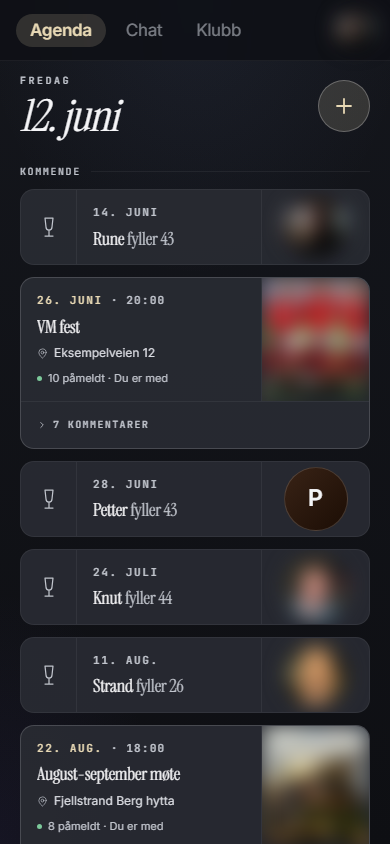
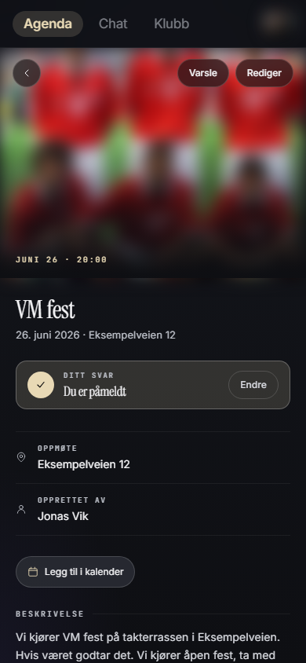
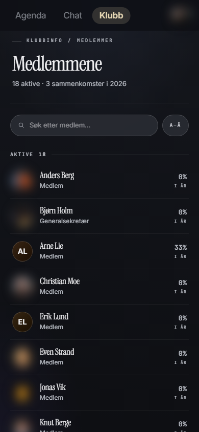
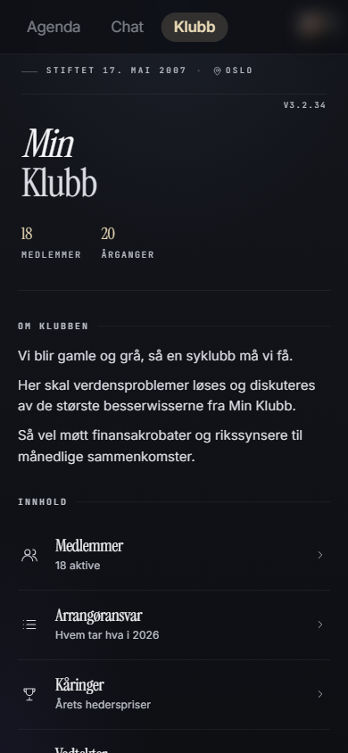
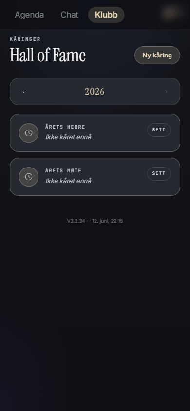
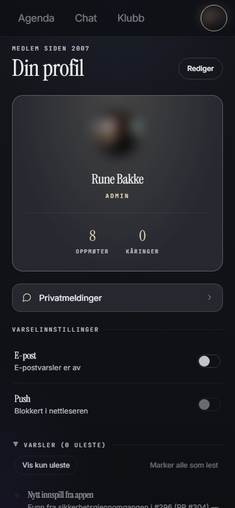

# Klubb-app

> **This project is intentionally in Norwegian** — UI text, code identifiers, table/column names, commit messages, and documentation are all in Norwegian. It was built for a Norwegian-speaking private club and is published as-is. You're welcome to fork it and translate it for your own club.

Privat web-app for vennegjenger som vil ha et felles sted for å holde kontakten — arrangementer og påmelding, chat, bilder, kart, kåringer og statistikk — uten å være avhengig av Facebook. Appen skal kunne driftes med gratis-tjenester.

Appen er bygget for én flate: installert PWA på mobiltelefon (iPhone primært, Android sekundært). Desktop og nettbrett er ikke målflater.

Repoet er en template: hver vennegjeng setter opp sin egen instans (én klubb per instans).

---

## Innhold

- [Funksjonalitet](#funksjonalitet)
- [Skjermbilder](#skjermbilder)
- [Stack](#stack)
- [Kom i gang](#kom-i-gang)
- [Arkitektur](#arkitektur)
- [Datamodell](#datamodell)
- [Sentrale designvalg](#sentrale-designvalg)
- [Mappe-struktur](#mappe-struktur)
- [Testing](#testing)
- [Drift og deploy](#drift-og-deploy)
- [Miljøvariabler](#miljøvariabler)
- [Kritisk vurdering](#kritisk-vurdering)
- [Lisens](#lisens)

---

## Funksjonalitet

- **Agenda** — forsiden. Kronologisk feed av arrangementer, polls, innlegg, bursdager, klubbjubileum og fondsrapporter, med en liten månedskalender i toppen. Arrangøransvar som ennå ikke er satt opp, vises som utkast. Hele historikken ligger på en egen side med filter (`/tidligere`).
- **Arrangementer** — møter og turer. Påmelding (Ja/Nei/Kanskje), kommentarer, bilde, album og kobling til arrangøransvar. Arrangøren kan «Varsle nå» og purre på dem som ikke har svart eller har svart kanskje. «Legg i kalender» (ICS).
- **Polls** — avstemninger med enkelt- eller flervalg og svarfrist.
- **Innlegg** — Facebook-status-aktige innlegg med bilder eller album, kommentarer og emoji-reaksjoner. En valgfri festedato holder innlegget øverst på agendaen til datoen er passert; KI kan foreslå datoen ut fra teksten.
- **Klubbchat** — én felles tråd i sanntid med bilder, reaksjoner, @-mentions og lenkeforhåndsvisning. Egen Chat-fane i topp-headeren.
- **Privatmeldinger** — én-til-én-samtaler.
- **Album** — bildedeling knyttet til arrangementer eller frittstående, med cover-velger. Lightbox med sveip, pil-knapper og pinch-zoom; reaksjoner og kommentarer per bilde. Bildene fra klubbchatten samles i et eget, levende album.
- **Kart** — frivillig posisjonsdeling som slår seg av etter 8 timer, med ruta siste døgn. Markeringer med symbol (noen varsler hele gjengen), «Pling» til en kamerat, stedsøk, «Nærmeste pub», timeplan for turen og chat i kartpanelet.
- **Reisemodus og møtemodus** — mens en tur eller en møtekveld pågår, blir kartet forsiden i fullskjerm. Hver mann kan slå det av for seg selv; admin skrur funksjonen av og på.
- **Stedene** — alle turene klubben har vært på, plottet på et Europakart med reiserute per år.
- **Roller og ansvar** — arrangøransvar per år.
- **Kåringer** — kategorier og årets vinnere, avgjort ved avstemning blant medlemmene. Ved uavgjort avgjør generalsekretæren.
- **Fond** — klubbens sparekonto som en enkel portefølje (eiendom, verdipapirer, kontanter, innskudd) med hvert medlems andel. Admin redigerer og publiserer kvartalsrapport på agendaen. Fanen kan forbeholdes admin.
- **Pass-tilgang** — medlemmer kan lagre passinfo. Arrangøren av en tur kan be om dagstilgang til deltakernes passinfo; generalsekretæren godkjenner, og tilgangen varer 24 timer.
- **Klubbinfo** — medlemsliste med kontaktinfo, statistikk over oppmøte og arrangering, og vedtekter med endringshistorikk.
- **Bursdager og klubbjubileum** dukker opp automatisk på agendaen. Bursdag gir morgenvarsel til alle, og kan i tillegg gi et KI-generert bursdagsbilde og en automatisk gratulasjon i chatten (begge styres av admin).
- **Varsler** — push og/eller e-post etter eget valg, og nivå «Viktig» eller «Alt». Gjelder blant annet nye arrangementer, påminnelser 7 dager og 1 dag før, chat og mentions, polls, kåringer og bursdager. Alle varsler samles i en innboks i appen.
- **Innspill** — medlemmene sender ønsker rett fra appen (blir GitHub-issues), følger dem på `/innspill` og får varsel med svar når de er levert.
- **Om appen** — sikkerhet, personvern og «Hva er nytt» (endringslogg).
- **Mørk/lys modus** — brukervalgt tema (System/Mørk/Lys) fra profilsiden. «System» følger enhetens preferanse, valget huskes per enhet.
- **Kontrollpanel (admin)** — medlemsadministrasjon, varsler og testmodus, av/på for funksjoner (Fond- og Chat-fanen, reisemodus, møtemodus, bursdagsbilde), faste arrangementer, kåringsmaler, kartalarmer og innsyn i bruk, varselhistorikk og ytelse.
- **PWA** — installerbar på mobil (Safari/Chrome). Tidligere besøkte sider vises fra cache ved nettbrudd.

---

## Skjermbilder

Fra en kjørende instans. Navn er fiktive og bilder blurret av personvernhensyn.

| Agenda | Arrangement | Medlemmer |
|---|---|---|
|  |  |  |

| Klubbinfo | Kåringer | Profil |
|---|---|---|
|  |  |  |

---

## Stack

| Lag | Teknologi |
|---|---|
| Frontend | Next.js 15 App Router, React 19, TypeScript, Tailwind v4 (mest inline-style) |
| Backend | Next.js Server Actions + Server Components + route handlers |
| Database | Supabase Postgres med Row Level Security |
| Auth | Supabase Auth (e-post + passord) |
| Realtime | Supabase Realtime (`postgres_changes`) for chat, reaksjoner og polls |
| Bildelagring | Cloudflare R2 (S3-kompatibel), `aws4fetch` for signing |
| E-post | Resend |
| Push | Web Push (VAPID) via `web-push` |
| Kart | Leaflet + Nominatim (OpenStreetMap) for geokoding — nøkkelfri (`lib/geokoding.ts`) |
| KI (valgfritt) | Anthropic Claude for datoforslag (`lib/anthropic.ts`), Google Vertex AI (EU) for bursdagsbilde (`lib/vertex.ts`) — hver av når nøkkelen mangler |
| Observability | `feil_logg` + strukturert logging (`lib/logg.ts`), `web-vitals`, valgfri Sentry (kun server-side) |
| Cron | GitHub Actions (påminnelser, bursdag, feil-alarm, backup, keepalive) |
| Hosting | Vercel (Hobby) |
| Domene | Valgfritt — konfigureres via env-vars |
| Testing | Vitest (enhets-, integrasjons- og komponenttester) + Playwright (e2e og RLS-tester, CI-port på hver PR) |

---

## Kom i gang

For å sette opp din egen instans:

1. **[docs/oppsett.md](docs/oppsett.md)** — steg-for-steg fra klon til kjørende instans (Supabase, R2, VAPID, Resend, Vercel, GitHub Actions).
2. **[docs/klubb-tilpasning.md](docs/klubb-tilpasning.md)** — bytt navn, ikoner, farger og konfigurer rollene for din klubb.
3. **[docs/drift.md](docs/drift.md)** — legge til medlemmer, feilsøke varsler, kjøre migrasjoner og backup.

```bash
git clone <ditt-repo-url>
cd <ditt-repo>
npm install
cp .env.example .env.local
# fyll inn verdiene
npm run sjekk-miljo
npm run dev
```

---

## Arkitektur

```
┌────────────────────────────────────────────────────┐
│           Klient (installert PWA, mobil)           │
│  React Server Components + Client Components       │
│  Service Worker (cache, push, push-klikk)          │
└──┬──────────────────┬──────────────────────────────┘
   │ WSS (realtime)   │ HTTPS
   │                  ▼
   │    ┌────────────────────────────────────────┐
   │    │           Next.js på Vercel            │
   │    │  • Server Components (SSR)             │
   │    │  • Server Actions (mutasjoner)         │
   │    │  • Route handlers (cron, webhook, API) │
   │    │  • Middleware (auth-guard via cookie)  │
   │    └──┬──────────┬──────────┬───────────┬───┘
   │       │          │          │           │
   │       │supabase- │aws4fetch │resend /   │fetch
   │       │js        │          │web-push   │
   ▼       ▼          ▼          ▼           ▼
┌──────────────┐ ┌─────────┐ ┌───────────┐ ┌─────────────────────┐
│ Postgres     │ │R2-bucket│ │ e-post /  │ │ Anthropic, Vertex,  │
│ + RLS        │ │(bilder) │ │ push      │ │ Nominatim, GitHub   │
│ + realtime   │ └─────────┘ └───────────┘ └─────────────────────┘
└──────────────┘

GitHub Actions ──(cron, CRON_SECRET)──▶ /api/cron/*
GitHub        ──(webhook)────────────▶ /api/github/webhook  (innspill-svar)
```

**Sikkerhetsmodellen** sentrerer rundt Postgres RLS. Server Actions kjører som innlogget bruker (Supabase auth-cookie sendes med). Det betyr at selv om en server action skulle ha en logikkfeil, kan ikke en bruker lese eller skrive data RLS-policyene ikke tillater. `er_admin()`-SQL-funksjonen brukes konsekvent i policies; i koden brukes `kanAdministrere(rolle)` fra `lib/roller.ts`. Middleware verifiserer JWT-en lokalt (JWKS), uten nettverksrunde mot Supabase.

En fullstendig gjennomgang av sikkerhetsmodellen er dokumentert i [docs/sikkerhetsgjennomgang-2026-06.md](docs/sikkerhetsgjennomgang-2026-06.md).

**Bilder via R2.** Cloudflare R2 valgt foran Supabase Storage for kostnad ($0 egress). Velg selv om bucketen skal ligge i EU-jurisdiksjon — sett i så fall `R2_JURISDICTION=eu`. Bilde-URL-ene er offentlig lesbare for den som har lenken — filnavnet (tidsstempel + tilfeldig suffiks) er laget for unikhet, ikke som hemmelighet. All rendring av lagrede URL-er går gjennom `bildeSrc()`, så tilgangskontroll kan legges inn ett sted senere.

---

## Datamodell

52 tabeller i `public`, gruppert etter domene (forenklet):

```
Medlemmer     profiles (rolle: medlem|admin|generalsekretaer, aktiv = false
              for utmeldte), pass_info, pass_tilgang_forespørsel

Arrangementer arrangementer (type: moete|tur) ── paameldinger (ja|nei|kanskje)
              arrangoransvar, arrangementmaler, timeplan_post

Innhold       meldinger (innlegg) ── melding_bilder, melding_reaksjon
              poll ── poll_valg ── poll_stemme
              album ── album_bilde ── album_bilde_reaksjon

Chat          6 tabeller med samme mønster: arrangement_chat, klubb_chat,
              poll_chat, melding_chat, samtale_chat (samtale = privat 1:1),
              album_bilde_chat — pluss chat_reaksjoner for chatmeldinger

Kåringer      kaaringmaler, kaaring_vinnere (avstemning via poll)

Kart          posisjon_deling, posisjon_punkt, kart_markering,
              kart_symbol_tilpasning

Fond          fond_eiendom, fond_verdipapir, fond_kontant, fond_innskudd,
              fond_bevegelse, fond_verdi_historikk, fond_navn_alias

Varsler       varsel_logg (innboksen — også rader uten utsending, kanal 'kun_app'),
              varsel_preferanser, varsel_innstillinger, push_subscriptions

Klubb         vedtekter, vedtekter_versjoner, klubb_info, app_innstillinger,
              bursdagsbilde, innspill_kobling

Drift         feil_logg (klient- og serverfeil, 180 dagers levetid),
              vitals_logg, aktivitet_dag, aktivitet_uke
```

Alle tabeller har RLS slått på. Lesing krever innlogget (og for de fleste tabeller aktiv) profil; skriving er typisk begrenset til eier eller `er_admin()`. Nyere tabeller har egne regler — f.eks. posisjoner som utløper, deling til utvalgte og pass-tilgang via `har_pass_tilgang()`.

Migrasjonene ligger i `supabase/migrations/`, nummerert sekvensielt. Se [Drift og deploy](#drift-og-deploy).

---

## Sentrale designvalg

Alle disse er kodifisert som «policies» i [`CLAUDE.md`](./CLAUDE.md) — referansen for AI-assistert utvikling fremover.

### Sentralisering der det betaler seg

- **Tid:** all dato-håndtering går gjennom `lib/dato.ts` med Europe/Oslo-tidssone via `date-fns-tz`. Ingen rå `new Date()` for å bestemme «hvilken dag det er» — håndhevet av ESLint-regelen `hk/dato-tidssone-uavhengig`.
- **Varsler:** all utgående kommunikasjon (push + e-post) går gjennom `sendVarsel()` i `lib/varsler.ts` — sentral dedup, brukerpreferanser, varselnivå, fortids-sperre og logging.
- **Auth:** server actions bruker `ensureAdmin()` / `ensureInnlogget()` fra `lib/auth.ts`. Ingen inline `getUser() + select rolle`-mønster.
- **Roller:** `lib/roller.ts` har sentral matrise. Aldri `rolle === 'admin'`-sammenligning i kode — bruk `kanAdministrere()`. Speilet i SQL via `er_admin()`-funksjonen.
- **Konstanter:** tegnegrenser, dag-vinduer og levetider i `lib/konstanter.ts`. Ingen hardkodede magiske tall.
- **Konfig:** miljø-avhengige verdier (BASE_URL, R2_PUBLIC_URL, GitHub-repo, VAPID-kontakt, KI-flagg) i `lib/config.ts`.
- **Klubbidentitet:** navn, stiftelsesdato, rolletitler og farger i `lib/klubb-config.ts` med env-override — se [docs/klubb-tilpasning.md](docs/klubb-tilpasning.md).
- **Tema:** alle farger er tokens i `app/globals.css` per `data-theme` (dark/light). Brukervalget (System/Mørk/Lys) lagres i localStorage + cookie; serveren rendrer riktig tema i SSR og et pre-hydration-script hindrer feil-tema-blink ved oppstart.
- **Bildelagring og -visning:** opplasting via server actions i `lib/actions/bilde-opplasting.ts` + `lib/r2.ts`, etter klient-side komprimering (1600 px / q0.85). All visning går gjennom `bildeSrc()` i `lib/bilde-utils.ts`.
- **Avatar:** `<Avatar>`-komponenten er bevisst enkel (kun `name`, `size`, `src`, `rolle`). Spesialtilfeller løses med lokale wrappere, ikke ved å utvide kjerne-komponenten.
- **KI:** hver modell-leverandør har sin egen tynne transport-modul (`lib/anthropic.ts`, `lib/vertex.ts`), og hver funksjon sitt eget av/på-flagg avledet av credentials. Vurdering mot AI-forordningen i [docs/ai-act-vurdering.md](docs/ai-act-vurdering.md).
- **Skjemaer og trykkflater:** alle skjemaer bygges av byggeklossene i `components/ui/Skjema.tsx`; alle trykkflater er minst 44 px, med felles komponenter (`Treffflate`, `TreffPille`, `TilbakeKnapp`, `TekstLenke`).
- **Observability:** feil fra klient og server logges med typede hendelsesnavn (`lib/logg.ts`, `lib/logg-hendelser.ts`) til `feil_logg`-tabellen, som ryddes etter 180 dager. Daglig cron varsler medlemmene som har slått på feilvarsler, så snart det finnes nye feil. Sentry kan kobles på server-side. Se [docs/feilstrategi.md](docs/feilstrategi.md).

### Chat-arkitektur

Seks chat-scopes (arrangement, klubb, poll, melding, privat, albumbilde) deler tabell-mønster men er fysisk separate tabeller (RLS er enklere per-tabell enn polymorf med `scope_type`-kolonne). All scope-spesifikk logikk samles i `lib/chat-konfig.ts` (`CHAT_KONFIG`) og generiske server actions i `lib/actions/chat.ts` (`sendChatMelding`, `oppdaterChatMelding`, `slettChatMelding`, `leggTilReaksjon`, `fjernReaksjon`).

### Hva som er bevisst utelatt

- **2FA / passkeys** — passordbasert er valgt nivå.
- **End-to-end-kryptering** av privatmeldinger.
- **Klient-side cache-lag** (TanStack Query) — SSR holder så langt.
- **Egen mobilapp** — PWA er valgt distribusjon.
- **Desktop og nettbrett** — kode som bare gir mening der, fjernes heller enn å vedlikeholdes.

---

## Mappe-struktur

Overordnet — ikke en fullstendig liste:

```
app/
  (auth)/                 # login, oppdater-passord
  (app)/                  # Innloggede sider med sticky TopHeader
    page.tsx              # Forsiden = agenda
    arrangementer/, tidligere/, poll/, kaaringspoll/, meldinger/
    chat/, samtaler/, album/
    kart/, stedene/, fond/
    klubbinfo/            # Medlemmer, statistikk, vedtekter
    arrangoransvar/, kaaringer/
    profil/, varsler/, innspill/, bli-utvikler/, om-appen/
    innstillinger/        # Kontrollpanel (admin)
  api/                    # Route handlers: cron (paaminne, bursdagsbilde,
                          # sjekk-klientfeil), GitHub-webhook, push, ICS,
                          # lenkeforhåndsvisning, logging, vitals, admin

components/
  <domene>/               # agenda, arrangement, album, chat, kart, fond, poll, …
  ui/                     # Felles byggeklosser: Avatar, Skjema, Treffflate, …
  TopHeader.tsx           # Tabs Agenda/Chat/Klubb + profil-avatar

lib/
  actions/                # Server actions — én fil per domene
  supabase/               # Browser- og server-clients, genererte typer
  varsler.ts, dato.ts, roller.ts, auth.ts, config.ts, konstanter.ts,
  klubb-config.ts, chat-konfig.ts, r2.ts, bilde-utils.ts, logg.ts,
  anthropic.ts, vertex.ts, geokoding.ts, kartmodus.ts, pending-nav.ts, …

supabase/migrations/      # Nummererte SQL-migrasjoner

scripts/                  # Miljøsjekk, init-admin, versjon-stamping,
                          # deploy-verifisering, React-rettelse (postinstall)

__tests__/                # Vitest
e2e/                      # Playwright (inkl. e2e/rls/) — aldri mot prod
```

---

## Testing

**Vitest:** enhetstester for helpers (dato, roller, mention, varsler, linkify m.fl.), integrasjonstester for server actions med mocket Supabase-klient, komponenttester i jsdom, og egne tester som pinner ESLint-reglene. Kjøres med `npm test`, og automatisk i CI på hver PR. Kjør `npm run test:tz` når du rører datokode — det sjekker Europe/Oslo og Pacific/Kiritimati med en egenkontroll som beviser at sonen faktisk slo gjennom; vanlig `TZ=...` fra Git Bash på Windows dropper stille sonen.

**End-to-end (Playwright):** spec-er for hovedflytene og for kart, reise-/møtemodus, fond, push-klikk m.m., pluss en røyktest som laster hver side. Testene logger inn som en seedet admin; `service_role` brukes til seeding og opprydding. E2e krever en **dedikert lokal Supabase-instans**, siden testene muterer data fritt (oppretter poller, endrer RSVP-svar) og derfor aldri skal kjøre mot produksjons-databasen din:

```bash
supabase start          # lokal test-instans (Docker)
npx supabase db reset   # kjører migrasjoner + seed-data (testbruker m.m.)
npx playwright test
```

`playwright.config.ts` har innebygde vakter: den nekter å starte hvis `E2E_SUPABASE_URL` peker mot sky-Supabase, og test-dev-serveren startes på egen port (3100) med egen env slik at en vanlig `npm run dev` mot prod aldri gjenbrukes. Uten `E2E_*`-variablene i `.env.local` skipper alle spec-ene med tydelig melding — e2e-oppsettet er valgfritt for å bruke appen. Full oppskrift i [e2e/README.md](e2e/README.md).

I CI trenger du ikke sette opp noe: `.github/workflows/pr-check.yml` starter sin egen `supabase start` i jobben, kjører suiten mot den og kaster den etterpå.

**Trykkflater:** røyktesten måler i tillegg at alle trykkflater er minst 44 px (`forventTreffbar()` i `e2e/helpers/treffmaal.ts`), og bryter testen hvis ikke.

**RLS-tester (Playwright, `e2e/rls/`):** verifiserer at Row Level Security faktisk stenger det den skal, med ekte `anon`- og `authenticated`-klienter. Kjøres med `npx playwright test --project=rls`. Legger du til en ny tabell med egne policyer, bør den få sin egen test her.

**ESLint-vakter:** egne regler i `eslint.config.mjs` krever at `error` leses fra hver Supabase-spørring og -mutasjon, og at datoer ikke avhenger av prosessens tidssone.

**Hva som ikke dekkes automatisk:** iOS-spesifikke quirks (visualViewport, safe-area, tastatur, PWA focus/blur) reproduserer ikke i Chromium-runneren og må verifiseres manuelt på iPhone.

---

## Drift og deploy

**Deploy:** push til `main` → Vercel bygger og deployer automatisk.

**Versjon:** `npm run stamp-versjon` oppdaterer `lib/versjon.json` og `CACHE_VERSION` i `public/sw.js` (invaliderer service-worker-cachen).

**Verifiser deploy:** `npm run verifiser-deploy` poller prod-URL-en og venter til `CACHE_VERSION` i `/sw.js` matcher `lib/versjon.json`, sånn at du vet at Vercel-deployen faktisk nådde ut:
```bash
npm run verifiser-deploy                      # leser NEXT_PUBLIC_BASE_URL fra .env.local
npm run verifiser-deploy https://min-klubb.no # eller som argument
```
Exit 0 = vellykket, exit 1 = timeout eller feil versjon.

**Cron (GitHub Actions):** alle schedule-triggerne er kommentert ut i templaten, så en fersk fork ikke feiler hver natt før secretene er satt. Aktiver dem ved å fjerne kommentaren på `schedule:`-linjene i hver workflow når secretene er satt (`CRON_SECRET` og `APP_URL`, se [docs/oppsett.md](docs/oppsett.md); for backup `SUPABASE_DB_URL`, se [docs/drift.md](docs/drift.md)).
- `.github/workflows/paaminne.yml` → `/api/cron/paaminne` og `/api/cron/bursdagsbilde`, fire ganger daglig (05–08 UTC). Påminnelser om kommende arrangementer sendes kl. 06 UTC; bursdagsvarselet går i første kjøring (de senere er reserve), og gratulasjonen i chatten legges på en tilfeldig av kjøringene.
- `.github/workflows/sjekk-klientfeil.yml` → `/api/cron/sjekk-klientfeil` kl. 05 UTC. Varsler ved nye feil i `feil_logg` og sletter rader eldre enn 180 dager.
- `.github/workflows/keepalive.yml` → pinger appen ukentlig, så Supabase free tier ikke pauses.
- `.github/workflows/db-backup.yml` → daglig `pg_dump` kl. 03:30 UTC (public/auth/storage), lagret som Actions-artifact med 90 dagers retention. **Free tier har ingen Supabase-backup — dette er den eneste.** Restore verifiseres med `db-restore-drill.yml` (manuell knapp, årlig drill). Se [docs/disaster-recovery.md](docs/disaster-recovery.md).

Cron-endepunktene krever `CRON_SECRET`-header. Valgt GitHub Actions foran Vercel Cron for bedre logging og synlig feilrapportering. Påminnelsene er idempotente: `sendVarsel()` deduperer på type + arrangement, så flere kjøringer samme dag gir ikke dobbelt varsel.

**Migrasjoner:** kan kjøres lokalt med `npx supabase db push`, eller fra CI med `.github/workflows/db-migrer.yml` (`gh workflow run db-migrer.yml`) hvis du legger inn secreten `SUPABASE_DB_URL`. Triggeren er bevisst manuell og ikke `push` — skjemaendringer mot en database uten leverandør-backup skal ha et eksplisitt «kjør nå». `--dry-run` kjøres alltid først, og etterpå verifiseres at migrasjonskøen faktisk er tom.

**Secrets:** Vercel env-vars. R2-credentials er markert «Sensitive» (kan ikke pulles tilbake).

**CI:** `.github/workflows/pr-check.yml` har to parallelle jobber: `kjerne` (lint, TypeScript-sjekk, Vitest) og `sjekk` (produksjonsbygg + Playwright-e2e inkludert RLS-testene mot en fersk Supabase-instans, med en egen sjekk på at alle migrasjonsfilene faktisk kjørte). En full PR-kjøring tar rundt 8 minutter. En PR der ingen endret fil kan påvirke en kjørende flyt (ren dokumentasjon, CI-skript, tester), hopper over e2e. På **push til `main`** kjøres kun kjerneporten (~3 min) — og bare når commiten ikke allerede er portet på en PR; det er derfor kodeendringer bør gå via PR. Build-steget bruker dummy-env-verdier og trenger ingen ekte secrets.

Budsjettvakten (`.github/scripts/ci-minuttbudsjett.mjs`) hopper over e2e-steget når månedens GitHub Actions-kvote er knapp. En grønn kjøring med kuttet e2e er «ukjent», ikke «verifisert» — se [docs/ci-minuttbudsjett.md](docs/ci-minuttbudsjett.md) for hvordan du sjekker hva som faktisk kjørte, og for hvordan tersklene justeres til ditt eget forbruk. Et offentlig repo har ubegrenset kvote og trenger i praksis ikke bry seg.

Anbefalt oppsett i GitHub: legg en **branch ruleset** på `main` med required status checks `kjerne` og `sjekk` (jobbene i `pr-check.yml`), og blokker force-push og sletting av branchen. Da kan ingen PR merges før CI er grønn. Status-sjekkene dukker først opp i ruleset-velgeren etter at workflow-en har kjørt minst én gang — åpne en liten test-PR først, eller skriv inn navnene manuelt. Rulesets er gratis på offentlige repoer; på et privat repo krever de betalt plan.

---

## Miljøvariabler

Kopier `.env.example` til `.env.local`, fyll inn verdiene, og kjør `npm run sjekk-miljo` for å verifisere:

```bash
cp .env.example .env.local
# fyll inn verdiene
npm run sjekk-miljo
```

Skriptet sjekker tre nivåer:

- **Kritisk** (Supabase, R2-nøkler og public-URL, VAPID-nøkler) — appen/kjernefunksjoner starter ikke uten disse.
- **Anbefalt** (Resend, `CRON_SECRET`, GitHub-token og `GITHUB_WEBHOOK_SECRET`, `VAPID_CONTACT_EMAIL`) — appen starter, men e-post, påminnelser eller innspill-funksjonen mangler.
- **Valgfri** (klubbidentitet, KI-nøkler, Sentry, R2-bucket/-jurisdiksjon m.m.) — har defaults eller slår av en funksjon. En valgfri variabel som er satt med feil format, regnes likevel som kritisk feil.

**`NEXT_PUBLIC_BASE_URL`** er påkrevd i produksjon — bygget kaster uten den, i stedet for å gjette en URL som kan avvike fra verten appen serveres fra.

**KI-funksjonene** slås på av at nøklene finnes: `ANTHROPIC_API_KEY` for datoforslag, `GOOGLE_VERTEX_SA_JSON_B64` + `GOOGLE_CLOUD_PROJECT` for bursdagsbilde (lokasjonen må være i EU). `ANTHROPIC_MODEL` og `GOOGLE_VERTEX_MODELL` kan overstyre modellvalget. Mangler nøklene, er funksjonen av og teksten på `/om-appen` tilpasser seg. Se `.env.example` for detaljer.

**SENTRY_DSN** (valgfri) — Sentry error tracking server-side. Uten den kjører appen helt fint; feil logges uansett til `feil_logg`. Opprett en egen Sentry-konto for din instans.

**CRON_SECRET** settes to steder med samme verdi: i Vercel env-vars (runtime-sjekken i cron-endepunktet) og som GitHub Actions-secret (workflow-en som sender headeren). Mismatch eller manglende verdi gir 401 fra cron-endepunktet.

**APP_URL** settes kun som GitHub Actions-secret (peker workflow-ene til prod-URL) — den brukes ikke av appen i runtime og hører ikke hjemme i `.env.local`. Det samme gjelder `SUPABASE_DB_URL` (backup og migrasjoner).

**Geokoding (Nominatim)** krever **ingen** miljøvariabel eller API-nøkkel. Tjenestens bruksvilkår krever en identifiserende `User-Agent`; den bygges automatisk fra `BASE_URL` + `VAPID_CONTACT_EMAIL`. Se [docs/geokoding.md](docs/geokoding.md).

---

## Kritisk vurdering

Denne seksjonen er for teknisk kyndige som vurderer kodebasen. Den er bevisst usminket.

### Hva er gjennomtenkt og solid

- **RLS som sannhet.** Sikkerheten henger ikke på at server actions er rett implementert — Postgres håndhever den. Dette er hovedinvestering og verdt det.
- **Sentralisering** av tid, varsler, roller, konstanter, auth, konfig og bildevisning. Dokumentert som policies, og der det er mulig håndhevet av ESLint-regler og tester. Hjelper både mennesker og AI å holde stilen.
- **Type-sikkerhet** via genererte Supabase-typer. Forbehold: typene regenereres manuelt etter migrering, og CI sjekker ikke at de stemmer med migrasjonene.
- **Server-first**. Mest dataflyt går gjennom Server Components, ikke klient-side fetch. Lavere TTFB, mindre JS over nettverket, ingen state-management i klient utover lokal interaksjon.
- **Append-only-mønster i historikk.** Inaktive medlemmer beholdes (`aktiv = false`); kåringer og arrangøransvar har egne årstall-rader. Sletting er sjelden.
- **Idempotent cron.** Påminnelsene dedupliseres på type + arrangement i `sendVarsel()`, så flere kjøringer samme dag ikke gir dobbelt varsel.
- **Feil skal synes.** Supabase-feil må leses (ESLint), og feil logges til `feil_logg` med alarm — en side som ser tom ut fordi en spørring feilet, regnes som en bug.
- **Backup med testet restore.** Daglig `pg_dump` via GitHub Actions (free tier har ingen Supabase-backup) og restore-drill som verifiserer gjenoppretting med målt RTO. Se [docs/disaster-recovery.md](docs/disaster-recovery.md).

### Pragmatiske snarveier

Disse er bevisste valg for et hobbyprosjekt med én utvikler — men en tradisjonell gjennomgang ville flagget dem.

- **Store komponenter.** `components/kart/PosisjonsKart.tsx` er over 2000 linjer; arrangement-detaljsiden, `Chat.tsx`, `MeldingKort.tsx` og `PaameldteListe.tsx` ligger på 680–770. Etter tradisjonell målestokk er de katedraler.
- **Styling via inline `style={{...}}` med CSS-variabler — et bevisst, vurdert valg.** Tokens (`var(--accent)` osv) overalt, aldri hardkodede verdier. Migrering til CSS-moduler/Tailwind er vurdert og avvist: en mobil-først touch-app har marginalt pseudo-klasse-behov, og smale inline-diffs passer AI-arbeidsflyten. Ikke skalerbart for større team, men riktig her.
- **Komponentlaget er tynt dekket.** Det finnes rundt 20 komponenttester i jsdom, men de er stort sett skrevet som vakter etter en konkret bug — ikke som systematisk dekning. En regresjon i en vilkårlig komponent fanges først av e2e eller av øyet.
- **`lib/actions/`-filer har lett gjenværende dupliserte mønstre** (varsel-sending etter insert, error-håndtering). Konsolidering er gjort der det betalte seg, ikke pedantisk overalt.
- **Noen få manuelle type-annotasjoner** der Supabase-inferensen ikke når: to `.overrideTypes`, en `as`-cast på en RPC som returnerer `json`, og to gjenværende `as unknown as`. Kommentert i koden.
- **iOS Safari-quirks håndteres i flere lag** (to tastatur-hooks på `visualViewport`, `interactiveWidget` i viewport-meta, push-klikk-overlevering via Cache Storage). Hver er begrunnet i koden og i CLAUDE.md, men aggregert kompleksitet er reell.

### Hva en profesjonell modning ville krevd

For et selskap eller team:

1. **Håndhevet CI:** PR-sjekken dekker lint, typer, enhets- og integrasjonstester, bygg, migrasjonsverifisering og e2e — men porten er bare påkrevd hvis du selv legger på en branch ruleset, og budsjettvakten kan kutte e2e på et privat repo.
2. **Observability:** latency-metrics og tracing utover `web-vitals` og strukturert feillogging.
3. **Skikkelig rollebasert tilgang i CI** + secrets via OIDC, ikke long-lived tokens.

For en privat klubb på 15–20 medlemmer er dette overkill. For en kommersiell SaaS er det baseline.

---

## Lisens

MIT — se [LICENSE](LICENSE).
